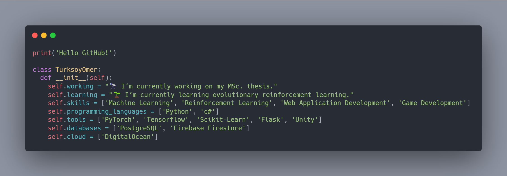

<h1 align="center">I'm <a href="https://www.linkedin.com/in/turksoyomer/">Ömer Türksoy<a></h1>

  

 
<h1 align="center">Tools I use!</h1>
 
 
||||||
|---|---|---|---|---|
||||||
  
  
 
<h1 align="center">My Github Stats!</h1>
 

 
<h1 align="center">Get in Touch!</h1>
 

 &nbsp;&nbsp;&nbsp;  
    &nbsp;&nbsp;&nbsp;       

<!--
**turksoyomer/turksoyomer** is a ✨ _special_ ✨ repository because its `README.md` (this file) appears on your GitHub profile.

Here are some ideas to get you started:

- 🔭 I’m currently working on ...
- 🌱 I’m currently learning ...
- 👯 I’m looking to collaborate on ...
- 🤔 I’m looking for help with ...
- 💬 Ask me about ...
- 📫 How to reach me: ...
- 😄 Pronouns: ...
- ⚡ Fun fact: ...
-->
